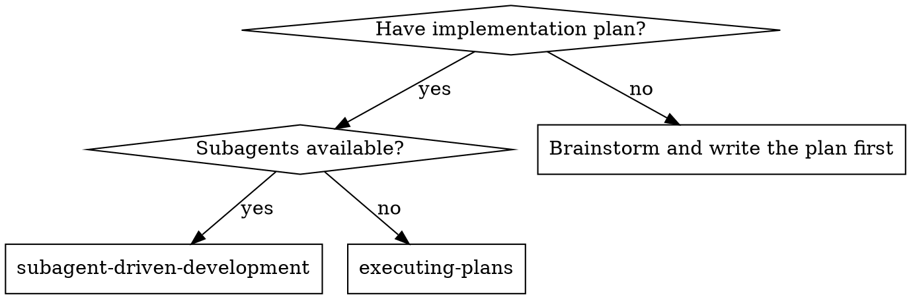
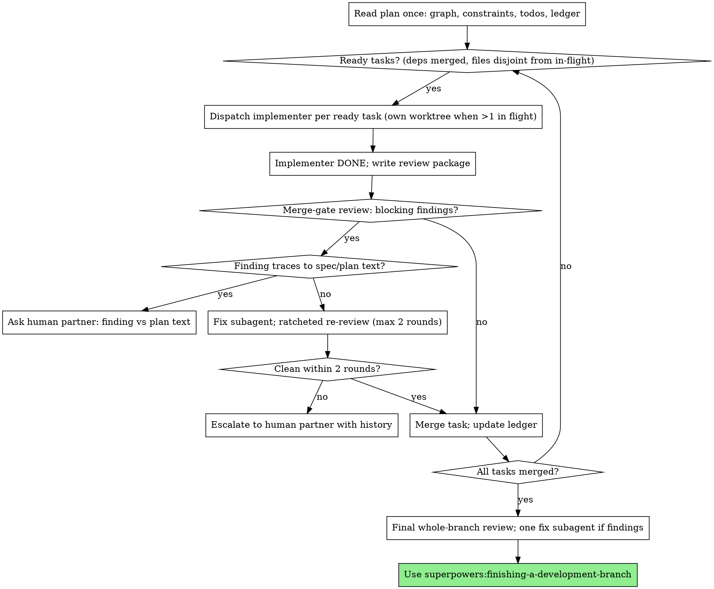

<OPT-IN-BOUNDARY>
Use this workflow only when the current user request explicitly opts into Superpowers or explicitly names `superpowers:subagent-driven-development`. Task relevance alone is never permission. Ask for permission before invoking another Superpowers workflow unless the user has already explicitly authorized chaining.
</OPT-IN-BOUNDARY>

# Subagent-Driven Development

Execute a plan by dispatching a fresh implementer subagent per task, scheduled from the plan's dependency graph — independent tasks run in parallel, each in its own worktree — with one bounded merge-gate review per task and a broad whole-branch review at the end.

**Why subagents:** You delegate tasks to specialized agents with isolated context. By precisely crafting their instructions and context, you ensure they stay focused and succeed at their task. They should never inherit your session's context or history — you construct exactly what they need. This also preserves your own context for coordination work.

**Core principle:** Fresh implementer per task + dependency-driven scheduling + bounded merge-gate review + broad final review = high quality, fast wall-clock

**Narration:** between tool calls, narrate at most one short line — the
ledger and the tool results carry the record.

**Continuous execution:** Do not pause to check in with your human partner between tasks. Execute all tasks from the plan without stopping. The only reasons to stop are: BLOCKED status you cannot resolve, ambiguity that genuinely prevents progress, an escalation this skill mandates (a spec conflict, a blocker that survives two fix rounds, a merge conflict), or all tasks complete. "Should I continue?" prompts and progress summaries waste their time — they asked you to execute the plan, so execute it.

## When to Use



**vs. Executing Plans (inline):**
- Fresh subagent per task (no context pollution)
- Parallel execution wherever the dependency graph allows
- Merge-gate review after each task, broad review at the end
- No human-in-loop between tasks

## The Process



## Pre-Flight Plan Review

Before dispatching Task 1, scan the plan once for conflicts:

- tasks that contradict each other or the plan's Global Constraints
- anything the plan explicitly mandates that the review rubric treats as a
  defect (a test that asserts nothing, verbatim duplication of a logic block)
- dependency-graph defects: cycles, a task that Consumes what nothing
  Produces, two tasks with no dependency path between them sharing a file

Present everything you find to your human partner as one batched question —
each finding beside the plan text that mandates it, asking which governs —
before execution begins, not one interrupt per discovery mid-plan. If the
scan is clean, proceed without comment. The review loop remains the net for
conflicts that only emerge from implementation.

## Scheduling From the Dependency Graph

The plan declares, per task, `Depends on:` and the files it owns. That is
the entire schedule — you never decide what "should" run in parallel, and
you never serialize what the graph leaves independent:

- A task is **ready** when every task it depends on is complete
  (implemented, reviewed, merged).
- Dispatch every ready task whose file set is disjoint from every task
  currently in flight.
- One task in flight: run it directly on the feature branch — a worktree
  for a solo task is overhead without benefit. Two or more: each task gets
  its own worktree (superpowers:using-git-worktrees) branched from the
  current feature branch. Implementers commit on their task branch; you
  merge.
- Merge each task back to the feature branch after its review passes, in
  completion order, then delete its worktree. Disjoint file sets make these
  merges trivial — a conflict means the plan's Files blocks were wrong:
  stop and reconcile with your human partner before continuing.
- After each merge, re-evaluate readiness and dispatch the newly unblocked.
- Before dispatching, record each dispatch in the ledger (task, worktree
  path, base commit) — parallel work multiplies what a lost context
  forgets.

Reviews gate merges: a task's diff is reviewed before it merges to the
feature branch, wherever it was implemented.

## Model Selection

Implementers work from briefs — requirements and contracts, not code to
transcribe. Brief-driven implementation is judgment work: default every
implementer and reviewer to a frontier model (your session's model), and
size deviations by risk, not token price.

- **Turn count beats token price.** Wall-clock and context cost scale with
  how many turns a subagent takes, and cheaper models routinely take 2-3×
  the turns on multi-step work — costing more overall.
- A genuinely mechanical, isolated task (a rename sweep, a config file, a
  single well-specified function) can drop a tier. When in doubt, don't.
- The final whole-branch review runs on the most capable available model.
- **Always specify the model explicitly when dispatching a subagent** so
  the choice is deliberate either way.

## Handling Implementer Status

Implementer subagents report one of four statuses. Handle each appropriately:

**DONE:** Generate the review package (`scripts/review-package BASE HEAD`, from this skill's directory — it prints the unique file path it wrote; BASE is the commit you recorded before dispatching the implementer — never `HEAD~1`, which silently drops all but the last commit of a multi-commit task), then dispatch the merge-gate reviewer with the printed path.

**DONE_WITH_CONCERNS:** The implementer completed the work but flagged doubts. Read the concerns before proceeding. If the concerns are about correctness or scope, address them before review. If they're observations (e.g., "this file is getting large"), note them and proceed to review.

**NEEDS_CONTEXT:** The implementer needs information that wasn't provided. Provide the missing context and re-dispatch.

**BLOCKED:** The implementer cannot complete the task. Assess the blocker:
1. If it's a context problem, provide more context and re-dispatch with the same model
2. If the task requires more reasoning, re-dispatch with a more capable model
3. If the task is too large, break it into smaller pieces
4. If the plan itself is wrong, escalate to the human

**Never** ignore an escalation or force the same model to retry without changes. If the implementer said it's stuck, something needs to change.

## The Merge-Gate Review

One reviewer per task, one question: **would you block this merge?**

The reviewer gets the task brief, the implementer's report (which carries
the test/lint/typecheck evidence), the review package (diff), and the
plan's global constraints. It judges both fidelity (does the diff do what
the brief requires — nothing critical missing, nothing harmful added) and
soundness (will anything here cause real problems — correctness, security,
data loss, a broken contract), and returns one verdict:

- **Blocking findings** — issues that justify holding the merge, each with
  what, where, and why. These get fixed now.
- **Observations** — everything else: style, structure, nice-to-haves.
  Record them in the progress ledger and move on. The final whole-branch
  review triages the accumulated list; one fix subagent handles whatever
  survives. Never dispatch a per-task fix for an observation.
- **⚠️ Cannot verify from diff** — requirements that live in unchanged code
  or span tasks. Resolve each one yourself before merging: you hold the
  plan and cross-task context the reviewer lacks. A confirmed gap is a
  blocking finding.

**The loop is bounded.** When the reviewer blocks:

1. Dispatch one fix subagent for all blocking findings together. Fix
   dispatches carry the implementer contract: re-run the covering tests,
   append results to the report file.
2. Re-review with the ratchet: the re-review's scope is the blocked
   findings plus any code the fix touched. It may not raise new findings
   on code it already passed — the finding set can only shrink.
3. Two fix rounds maximum. A blocker that survives both goes to your human
   partner with the finding and both fix attempts — never a third round.

**Spec conflicts short-circuit the loop.** If a finding traces to the plan
or spec text itself, or a fix would add complexity to satisfy a spec line
the implementation has outgrown, that is a spec problem, not an
implementation problem. Take it to your human partner immediately —
present the finding and the plan text, ask which governs. Zero fix rounds.

## Constructing Reviewer Prompts

Per-task reviews are merge gates. The broad review happens once, at the
final whole-branch review. When you fill a reviewer template:

- Do not add open-ended directives like "check all uses" or "run race tests
  if useful" without a concrete, task-specific reason
- Do not ask a reviewer to re-run tests the implementer already ran on the
  same code — the implementer's report carries the test evidence
- Do not pre-judge findings for the reviewer — never instruct a reviewer to
  ignore or not flag a specific issue. If you believe a finding would be a
  false positive, let the reviewer raise it and adjudicate it in the review
  loop. If the prompt you are writing contains "do not flag," "don't treat X
  as a defect," "at most an observation," or "the plan chose" — stop: you
  are pre-judging, usually to spare yourself a review loop.
- The global-constraints block you hand the reviewer is its attention
  lens. Copy the binding requirements verbatim from the plan's Global
  Constraints section or the spec: exact values, exact formats, and the
  stated relationships between components ("same layout as X", "matches
  Y"). The reviewer's template already carries the process rules (YAGNI,
  test hygiene, review method) — the constraints block is for what THIS
  project's spec demands.
- Hand the reviewer its diff as a file: run this skill's
  `scripts/review-package BASE HEAD` and pass the reviewer the file path
  it prints (or, without bash: `git log --oneline`, `git diff --stat`,
  and `git diff -U10` for the range, redirected to one uniquely named
  file). The output never enters your own context, and the reviewer sees
  the commit list, stat summary, and full diff with context in one Read
  call. Use the BASE you recorded before dispatching the implementer —
  never `HEAD~1`, which silently truncates multi-commit tasks.
- A dispatch prompt describes one task, not the session's history. Do not
  paste accumulated prior-task summaries ("state after Tasks 1-3") into
  later dispatches — a real session's dispatch hit 42k chars of which 99%
  was pasted history. A fresh subagent needs its task, the interfaces it
  touches, and the global constraints. Nothing else.
- A re-review dispatch names the findings being re-checked and the commits
  the fix added, and uses the template's re-review variant so the ratchet
  is explicit: prior findings RESOLVED or STILL BLOCKED, new findings only
  in code the fix touched.
- Every fix dispatch carries the implementer contract: the fix subagent
  re-runs the tests covering its change and reports the results. Name the
  covering test files in the dispatch — a one-line fix does not need the
  whole suite. Before re-dispatching the reviewer, confirm the fix report
  contains the covering tests, the command run, and the output; dispatch
  the re-review once all three are present.
- If the final whole-branch review returns findings, dispatch ONE fix
  subagent with the complete findings list — not one fixer per finding.
  Per-finding fixers each rebuild context and re-run suites; a real
  session's final-review fix wave cost more than all its tasks combined.
- The final whole-branch review gets a package too: run
  `scripts/review-package MERGE_BASE HEAD` (MERGE_BASE = the commit the
  branch started from, e.g. `git merge-base main HEAD`) and include the
  printed path in the final review dispatch, so the final reviewer reads
  one file instead of re-deriving the branch diff with git commands. Point
  it at the ledger's accumulated observations to triage which must be
  fixed before merge — a roll-up nobody reads is a silent discard.

## File Handoffs

Everything you paste into a dispatch prompt — and everything a subagent
prints back — stays resident in your context for the rest of the session
and is re-read on every later turn. Hand artifacts over as files:

- **Task brief:** before dispatching an implementer, run this skill's
  `scripts/task-brief PLAN_FILE N` — it extracts the task's full text to a
  uniquely named file and prints the path. Compose the dispatch so the
  brief stays the single source of requirements. Your dispatch should
  contain: (1) one line on where this task fits in the project; (2) the
  brief path, introduced as "read this first — it is your requirements,
  with the exact values to use verbatim"; (3) interfaces and decisions
  from earlier tasks that the brief cannot know; (4) your resolution of
  any ambiguity you noticed in the brief; (5) the working directory (the
  task's worktree when running in parallel); (6) the report-file path and
  report contract. Exact values (numbers, magic strings, signatures, test
  cases) appear only in the brief.
- **Report file:** name the implementer's report file after the brief
  (brief `…/task-N-brief.md` → report `…/task-N-report.md`) and put it in
  the dispatch prompt. The implementer writes the full report there and
  returns only status, commits, a one-line gate summary, and concerns.
- **Reviewer inputs:** the merge-gate reviewer gets three paths — the same
  brief file, the report file, and the review package — plus the global
  constraints that bind the task.
- Fix dispatches append their fix report (with test results) to the same
  report file and return a short summary; re-reviews read the updated file.

## Durable Progress

Conversation memory does not survive compaction. In real sessions,
controllers that lost their place have re-dispatched entire completed task
sequences — the single most expensive failure observed. Track progress in
a ledger file, not only in todos.

- At skill start, check for a ledger:
  `cat "$(git rev-parse --show-toplevel)/.superpowers/sdd/progress.md"`. Tasks listed there
  as complete are DONE — do not re-dispatch them; resume at the first task
  not marked complete.
- Record dispatches before making them:
  `Task N: dispatched (worktree <path>, base <sha7>)` — with parallel
  tasks in flight, this is the only record of who is working where.
- When a task's review comes back clean and it merges, append one line to
  the ledger in the same message as your other bookkeeping:
  `Task N: complete (commits <base7>..<head7>, review clean, merged)`.
- Append observations from each review to the ledger as they arrive — the
  final whole-branch review triages this list.
- The ledger is your recovery map: the commits it names exist in git even
  when your context no longer remembers creating them. After compaction,
  trust the ledger and `git log` over your own recollection.
- `git clean -fdx` will destroy the ledger (it's git-ignored scratch); if
  that happens, recover from `git log`.

## Prompt Templates

- [implementer-prompt.md](implementer-prompt.md) - Dispatch implementer subagent
- [task-reviewer-prompt.md](task-reviewer-prompt.md) - Dispatch merge-gate reviewer subagent (includes the re-review variant)
- Final whole-branch review: use superpowers:requesting-code-review's [code-reviewer.md](../requesting-code-review/code-reviewer.md)

## Example Workflow

```
You: I'm using Subagent-Driven Development to execute this plan.

[Read plan once: 4 tasks. Task 1 and Task 2 depend on none, disjoint files.
 Task 3 depends on 1+2. Task 4 depends on 3. Create todos + ledger.]

[Ledger: Task 1 dispatched (worktree ../wt-t1, base a1b2c3d)]
[Ledger: Task 2 dispatched (worktree ../wt-t2, base a1b2c3d)]
[Dispatch implementer Task 1 and implementer Task 2 in parallel]

Task 1 implementer: DONE — 6/6 passing, lint clean, typecheck clean
[Run review-package for Task 1; dispatch merge-gate reviewer]
Task 1 reviewer: APPROVE. Observations: extract-worthy helper in parser.ts (ledger).
[Merge Task 1. Task 3 still blocked on Task 2.]

Task 2 implementer: DONE — 9/9 passing, lint clean, typecheck clean
Task 2 reviewer: BLOCK — brief requires E402 on oversize amounts;
  diff returns a generic 500 (api/trades.ts:84).
[Dispatch fix subagent with the finding; fix appends test results to report]
[Ratcheted re-review: finding RESOLVED, no new findings in scope. APPROVE.]
[Merge Task 2 → Task 3 ready; alone in flight, so no worktree — dispatch
 on the feature branch]

Task 3 implementer: DONE — 11/11 passing, lint clean, typecheck clean
Task 3 reviewer: APPROVE.
[Merge Task 3 → Task 4 ready; dispatch...]

[All tasks merged]
[Final whole-branch review (most capable model) with the branch package +
 ledger observations; findings → ONE fix subagent; re-verify]
Final reviewer: Ready to merge.

Done!
```

## Advantages

**vs. Manual execution:**
- Subagents follow TDD naturally
- Fresh context per task (no confusion)
- Independent tasks overlap in wall-clock instead of queueing

**Efficiency gains:**
- Controller curates exactly what context is needed; bulk artifacts move
  as files, not pasted text
- Subagent gets complete information upfront
- The dependency graph, not habit, decides what runs concurrently

**Quality gates:**
- Self-review catches issues before handoff
- Merge-gate review blocks real problems before they enter the feature
  branch; observations ride to the final review instead of spawning
  per-task fix loops
- Bounded review loops (two fix rounds, then escalate) keep cost
  predictable and end reviewer ping-pong
- Final whole-branch review catches cross-task issues and triages
  accumulated observations with one fix pass

**Cost:**
- More subagent invocations than inline execution (implementer + reviewer
  per task) — but tasks are PR-sized, so there are few of them
- Parallel dispatch reclaims wall-clock on independent tasks
- Bounded loops cap the worst case; catching issues at the gate stays
  cheaper than debugging after merge

## Red Flags

**Never:**
- Start implementation on main/master branch without explicit user consent
- Dispatch a task whose dependencies haven't merged, or whose files overlap
  a task in flight
- Merge a task that hasn't passed its merge-gate review
- Dispatch a per-task fix subagent for a non-blocking observation —
  observations go to the ledger and the final review
- Let a re-review raise new findings on unchanged code it already passed
  (the ratchet: the finding set can only shrink)
- Run a third fix round — after two, escalate to your human partner
- Dismiss a finding because the plan mandates it, or dispatch a fix that
  contradicts the plan without asking — spec conflicts go to the human,
  immediately
- Make a subagent read the whole plan file (hand it its task brief —
  `scripts/task-brief` — instead)
- Skip scene-setting context (subagent needs to understand where task fits)
- Ignore subagent questions (answer before letting them proceed)
- Let implementer self-review replace the merge-gate review (both are needed)
- Tell a reviewer what not to flag, or pre-rate a finding's severity in the
  dispatch prompt — the plan's contract code is a starting point, not
  evidence that its weaknesses were chosen
- Dispatch a reviewer without a diff file — generate it first
  (`scripts/review-package BASE HEAD`) and name the printed path in the
  prompt
- Re-dispatch a task the progress ledger already marks complete — check
  the ledger (and `git log`) after any compaction or resume

**If subagent asks questions:**
- Answer clearly and completely
- Provide additional context if needed
- Don't rush them into implementation

**If the reviewer blocks:**
- One fix subagent for all blocking findings together
- Ratcheted re-review — scoped to the findings and what the fix touched
- Two rounds maximum; then escalate with the full history
- Don't fix issues yourself in the controller session (context pollution)

## Integration

**Required workflow skills:**
- **superpowers:using-git-worktrees** - Ensures isolated workspace (creates one or verifies existing); also used per-task when parallel tasks are in flight
- **superpowers:writing-plans** - Creates the plan this skill executes
- **superpowers:requesting-code-review** - Code review template for the final whole-branch review
- **superpowers:finishing-a-development-branch** - Complete development after all tasks

**Subagents should use:**
- **superpowers:test-driven-development** - Subagents follow TDD for each task

**Alternative workflow:**
- **superpowers:executing-plans** - Inline execution in this session when subagents aren't available
